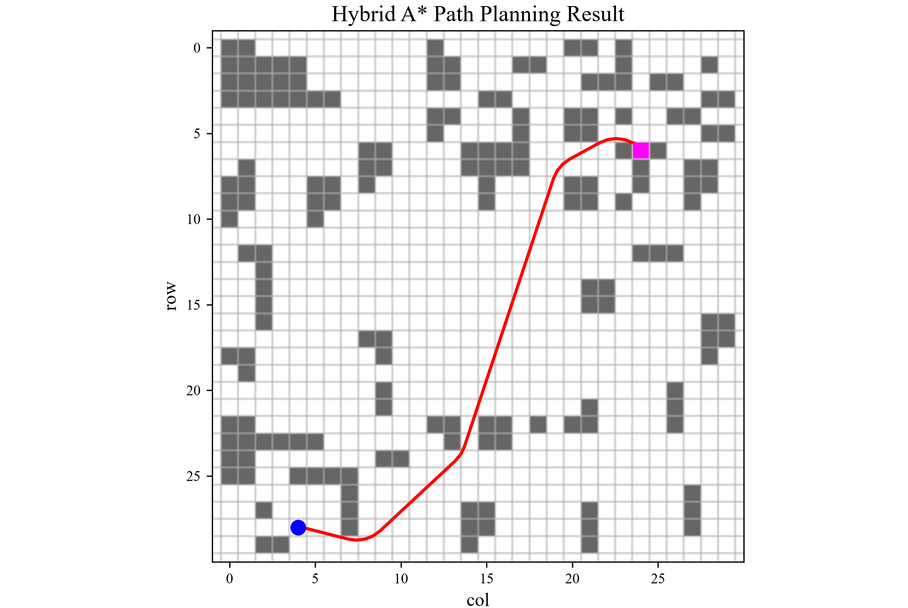

# Hybrid A* Path Planning

Hybrid A* 路径规划算法，采用两轮自行车模型，支持连续空间搜索可视化。暂未考虑车辆尺寸。

### 核心特性
- **地图存储**：地图数据存储于可编辑的 Excel 文件中，由 30×30 矩形区域表示。
- **连续状态空间**：状态为 $(x, y, \theta)$，其中 $\theta$ 为后轮相对$x$轴的偏角
- **自行车运动学模型**：采用闭式圆弧解进行状态传播。几何意义表现为先求解运动瞬心的坐标，再求解圆弧终点的坐标。
- **预设运动原语**：5 种转向角 × 2 种方向（前进/后退），支持倒车搜索。过滤直行后立马后退的情况。

- **多级代价函数**：后退惩罚 + 转向惩罚 + 换向惩罚，尽可能路径平滑。
- **状态离散化去重**：将连续状态映射到 $(x, y, \theta)$ 三维 bin，避免重复展开
- **可视化**：基于 matplotlib 的可视化

### 运动学模型

自行车模型（Bicycle Model）的运动学方程：

$$
\begin{aligned}
\dot{x} &= v \cos\theta \\
\dot{y} &= v \sin\theta \\
\dot{\theta} &= \frac{v}{L} \tan\delta
\end{aligned}
$$

其中 $L$ 为轴距， $\delta$ 为前轮转向角， $v$ 为速度（前进为正，后退为负）。

圆弧传播的闭式解（定轴转动）：

$$
\begin{aligned}
R &= \frac{L}{\tan\delta} \\
\Delta\theta &= \frac{d}{R} \\
x_c &= x - R \sin\theta \\
y_c &= y + R \cos\theta \\
x' &= x_c + R \sin(\theta + \Delta\theta) \\
y' &= y_c - R \cos(\theta + \Delta\theta)
\end{aligned}
$$

其中 $(x_c, y_c)$ 为瞬时旋转中心， $d$ 为弧长， $R$ 为转弯半径。


## 项目结构

```
hybrid-a-star-planning/
├── algorithms_py/
│   └── Hybrid_A_star.py
├── utils/
│   └── grid_map_data.py 
├── save_png/
│   └── Hybrid_A_star.png.png
├── README.md
├── LICENSE
├── requirements.txt
├── map.xlsx
└── .gitignore
```

## 运行方式

### 依赖安装

```bash
pip install -r requirements.txt
```

### 运行

```bash
python src/hybrid_a_star.py
```

运行后将弹出 matplotlib 窗口，展示栅格地图、障碍物、搜索路径以及起点终点标记。

## 参数配置

车辆与搜索参数定义在 `BikeCarModel` 类中，可根据需要调整：

| 参数 | 默认值 | 含义 |
|------|--------|------|
| `L` | 2.0 m | 车辆轴距 |
| `steer_max` | π/4 rad | 最大转向角（45°） |
| `arc_len` | 0.5 m | 每个运动原语的弧长 |
| `coord_res` | 0.25 m | 位置离散化分辨率 |
| `theta_res` | π/12 rad | 角度离散化分辨率（15°） |
| `w_reverse` | 2.0 | 后退惩罚权重 |
| `w_steer` | 1.2 | 转向惩罚权重 |
| `w_steer_change` | 1.5 | 换向惩罚权重 |

## 技术要点

### 闭式圆弧传播

采用圆心 + 角度旋转的解析解计算圆弧轨迹，相比数值积分（如欧拉法）无累积误差，轨迹精度更高。直行时退化为线性插值。

### 状态离散化去重

将连续状态 $(x, y, \theta)$ 分别按 `coord_res` 和 `theta_res` 离散化为整数 bin，同一 bin 内的状态视为已访问，避免无限展开。分辨率越细，路径越平滑但搜索越慢；越粗，搜索越快但可能漏掉可行解。

### Lazy 删除策略

优先队列中可能存在同一 bin 的多个节点（代价不同）。弹出时通过比较 `g_cost` 判断是否为过时节点，过时则跳过，避免显式 decrease-key 操作。

### 禁止前进立即倒车

当上一步为前进时，禁止下一步直接后退，避免产生无意义的 Z 字形路径。

## 许可证

[MIT License](LICENSE)

**Hybrid A\* Result**
<div align="center">

</div>


## 许可证

[MIT License](LICENSE)
